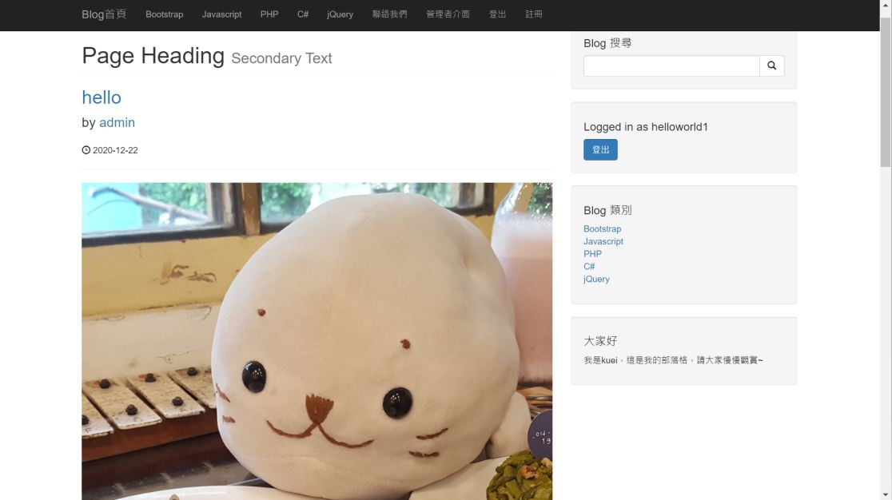
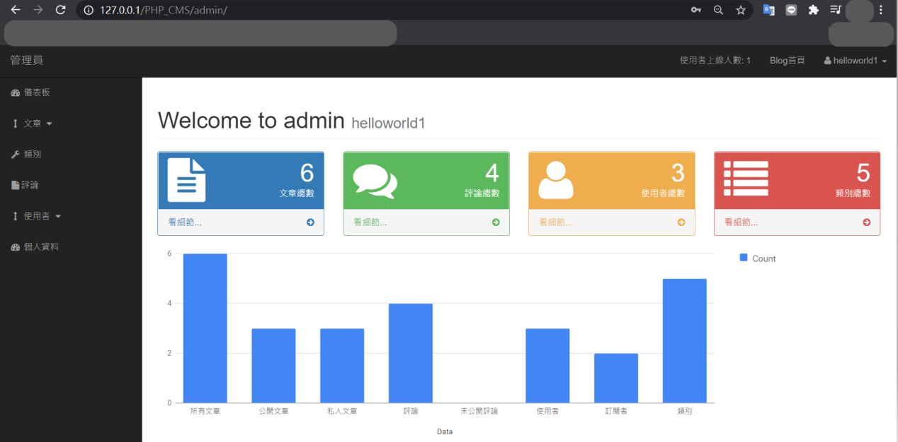
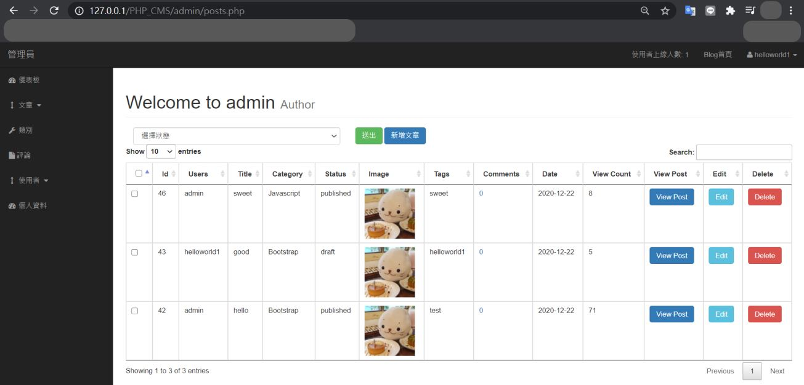

# PHP Blog

本篇blog參考至Udemy教學課程，逐步練習所完成

## 結果如下
##### 部落格首頁

##### 管理者首頁

##### 管理者所有文章

##### 資料庫關聯圖

## 開發工具

Visual Studio Code
Debug (XDebug)

## 參考資料：

線上課程 Udemy

課程名稱：PHP for Beginners - Become a PHP Master - CMS Project  

講者：Edwin Diaz
